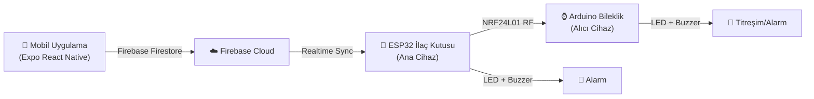

# 🏥 CareSync Bileklik Projesi – Kurulum & Çalıştırma Kılavuzu

## 📋 Proje Durumu Analizi

Proje **tamamen kodlanmış** ve çalışmaya hazır durumda. Aşağıdaki bileşenler mevcut:

### ✅ Tamamlanmış Bileşenler

| Bileşen | Durum | Açıklama |
|---------|-------|----------|
| **Expo React Native Uygulaması** | ✅ Hazır | SDK 55, React 19.2, RN 0.83.4 |
| **Firebase Entegrasyonu** | ✅ Hazır | Firestore + Auth yapılandırılmış |
| **ESP32 İlaç Kutusu Firmware** | ✅ Hazır | WiFi + Firebase + NRF24L01 |
| **Arduino Bileklik Firmware** | ✅ Hazır | NRF24L01 alıcı modda |
| **Navigasyon Sistemi** | ✅ Hazır | Bottom Tab Navigator (4 ekran) |
| **Tema / Tasarım Sistemi** | ✅ Hazır | Material Design 3 tarzı |
| **EAS Build Yapılandırması** | ✅ Hazır | Dev, Preview, Production profilleri |
| **Asset Dosyaları** | ✅ Hazır | Icon, splash, adaptive icons |

### 📱 Uygulama Ekranları
- **Dashboard** – Ana panel, cihaz durumu, ilaç özeti
- **Schedule** – Haftalık ilaç planı takvimi
- **Alerts** – Bildirimler ve uyarılar
- **Settings** – Profil, hasta, cihaz ve uygulama ayarları

### 🔧 Donanım Mimarisi



---

## 🚀 ADIM ADIM KURULUM KILAVUZU

### Adım 1: Ön Gereksinimler

Bilgisayarınızda aşağıdakilerin kurulu olduğundan emin olun:

```powershell
# Node.js kurulu mu kontrol et (v18+ gerekli)
node -v

# npm kurulu mu kontrol et
npm -v
```

> [!IMPORTANT]
> **Node.js v18 veya üzeri** gereklidir. Yoksa [nodejs.org](https://nodejs.org) adresinden indirin.

### Adım 2: Proje Bağımlılıklarını Yükle

```powershell
# Proje dizinine git
cd E:\bileklikk-main

# Bağımlılıkları temiz yükle
# (node_modules zaten var ama sorun çıkarsa aşağıdakileri uygulayın)
npm install
```

> [!TIP]
> Eğer sorun yaşarsanız, temiz kurulum yapın:
> ```powershell
> Remove-Item -Recurse -Force node_modules
> Remove-Item package-lock.json
> npm install
> ```

### Adım 3: EAS CLI Kurulumu

EAS (Expo Application Services) CLI'ı global olarak kurun:

```powershell
npm install -g eas-cli
```

### Adım 4: Expo Hesabı Girişi

```powershell
# Expo hesabınıza giriş yapın
npx eas login
```

> [!NOTE]
> Hesap bilgileri:
> - **Owner**: `saglikbileklik` (app.json'da tanımlı)
> - Eğer hesabınız yoksa [expo.dev](https://expo.dev) adresinden oluşturun

### Adım 5: Expo Go ile Test (Hızlı Test)

Expo Go uygulaması ile **fiziksel cihazınızda** hızlıca test edebilirsiniz:

```powershell
# Expo dev sunucusunu başlat
npx expo start
```

**Telefonda test için:**
1. **Android**: Google Play Store'dan "Expo Go" uygulamasını indirin
2. Terminalde gösterilen **QR kodu** Expo Go ile tarayın
3. Uygulama telefonunuzda açılacak

> [!WARNING]
> **Expo Go Sınırlamaları**: Expo Go, `expo-dev-client` gibi native modüller gerektiren bazı özellikleri desteklemez. Tam test için Adım 6'daki Development Build kullanın.

### Adım 6: Development Build Oluşturma (Önerilen)

Bu, tüm native modülleri içeren özel bir Expo Go sürümü oluşturur:

```powershell
# Android Development APK oluştur (EAS Cloud üzerinde)
npx eas build --profile development --platform android
```

**Bu komut:**
- Kodu EAS sunucularına yükler
- Cloud'da APK oluşturur (5-15 dk sürer)
- İndirme linki verir

**APK'yı Yükledikten Sonra:**
```powershell
# Dev sunucusunu özel client için başlat
npx expo start --dev-client
```

### Adım 7: Preview APK (Test Dağıtımı)

Başkalarına test ettirmek için preview APK oluşturun:

```powershell
# Preview APK oluştur
npx eas build --profile preview --platform android
```

### Adım 8: Production Build (Yayın)

Google Play Store'a yüklemek için:

```powershell
# Production App Bundle oluştur
npx eas build --profile production --platform android
```

---

## ⚙️ Firebase Yapılandırma Durumu

### Mobil Uygulama Firebase Config
Dosya: [firebase.js](file:///e:/bileklikk-main/src/config/firebase.js)

| Alan | Değer | Durum |
|------|-------|-------|
| Project ID | `saglikbileklik-356ed` | ✅ Ayarlanmış |
| Auth Domain | `saglikbileklik-356ed.firebaseapp.com` | ✅ Ayarlanmış |
| API Key | `AIzaSyDHII3X...` | ✅ Ayarlanmış |

### Google Services (Android Native)
Dosya: [google-services.json](file:///e:/bileklikk-main/google-services.json)

> [!CAUTION]
> **Uyumsuzluk Tespit Edildi!** İki farklı Firebase projesi kullanılıyor:
> - `firebase.js` → Project: **saglikbileklik-356ed**
> - `google-services.json` → Project: **saglikbileklik-23ef9**
> 
> Bu durum native Android build'lerde sorun çıkarabilir. Her iki dosya da **aynı Firebase projesine** işaret etmeli.

### ESP32 Firebase Config
Dosya: [esp32_medicine_box.ino](file:///e:/bileklikk-main/hardware/esp32/esp32_medicine_box.ino)

| Alan | Değer | Durum |
|------|-------|-------|
| API_KEY | `"FIREBASE_API_KEY_BURAYA"` | ❌ **Güncellenmeli** |
| PROJECT_ID | `"FIREBASE_PROJECT_ID_BURAYA"` | ❌ **Güncellenmeli** |
| WIFI_SSID | `"WIFI_ADINIZ"` | ❌ **Güncellenmeli** |
| WIFI_PASSWORD | `"WIFI_SIFRENIZ"` | ❌ **Güncellenmeli** |

---

## 🔌 ESP32 Donanım Kurulumu

### Gerekli Malzemeler

| Malzeme | Adet | Kullanım |
|---------|------|----------|
| ESP32-S3 Dev Board | 2 | İlaç kutusu + Bileklik |
| NRF24L01 Modül | 2 | Kablosuz RF haberleşme |
| LED (Kırmızı/Yeşil) | 2 | Görsel uyarı |
| Buzzer | 2 | Sesli uyarı |
| Push Button | 2 | İlaç onay butonu |
| Breadboard + Jumper | - | Bağlantı |

### Pin Bağlantı Şeması

```
ESP32 İlaç Kutusu (Ana Cihaz)
━━━━━━━━━━━━━━━━━━━━━━━━━━━━━
 ESP32 Pin    →  Bileşen
 GPIO 4       →  LED (+)
 GPIO 46      →  Buzzer (+)
 GPIO 36      →  Button (bir ucu GND'ye)
 GPIO 5       →  NRF24 MOSI
 GPIO 6       →  NRF24 MISO
 GPIO 7       →  NRF24 SCK
 GPIO 15      →  NRF24 CE
 GPIO 16      →  NRF24 CSN
 3.3V         →  NRF24 VCC
 GND          →  NRF24 GND + LED(-) + Buzzer(-) + Button
```

### Arduino IDE ile ESP32 Firmware Yükleme

1. **Arduino IDE** indirin: [arduino.cc/en/software](https://www.arduino.cc/en/software)
2. **ESP32 Board Paketi** ekleyin:
   - File → Preferences → Additional Board URLs:
   ```
   https://raw.githubusercontent.com/espressif/arduino-esp32/gh-pages/package_esp32_index.json
   ```
3. **Gerekli Kütüphaneler**:
   - `Firebase_ESP_Client` (by Mobizt)
   - `RF24` (by TMRh20)
4. **Board seçimi**: ESP32S3 Dev Module
5. Firmware dosyasını açın: `hardware/esp32/esp32_medicine_box.ino`
6. WiFi ve Firebase bilgilerinizi doldurun
7. Upload butonuna basın

---

## 📂 Proje Yapısı Özeti

```
bileklikk-main/
├── App.js                          # Ana uygulama bileşeni
├── index.js                        # Expo entry point
├── app.json                        # Expo yapılandırması
├── eas.json                        # EAS Build profilleri
├── package.json                    # Bağımlılıklar (Expo 55)
├── google-services.json            # Firebase Android config
│
├── src/
│   ├── config/
│   │   └── firebase.js             # Firebase Web SDK config
│   ├── context/
│   │   ├── AuthContext.js           # Kimlik doğrulama state
│   │   └── PatientContext.js        # Hasta verileri state
│   ├── navigation/
│   │   └── AppNavigator.js          # Tab navigasyon yapısı
│   ├── screens/
│   │   ├── DashboardScreen.js       # Ana panel
│   │   ├── ScheduleScreen.js        # İlaç takvimi
│   │   ├── AlertsScreen.js          # Bildirimler
│   │   ├── LoginScreen.js           # Giriş ekranı
│   │   └── SettingsScreen.js        # Ayarlar
│   ├── components/
│   │   ├── AlertOverlay.js          # Alarm overlay
│   │   ├── BottomSheet.js           # Alt panel
│   │   ├── DeviceStatusBadge.js     # Cihaz durum badge
│   │   ├── FAB.js                   # Floating action button
│   │   ├── MedicationCard.js        # İlaç kartı
│   │   └── TimelineItem.js          # Zaman çizelgesi öğesi
│   ├── services/
│   │   ├── alertService.js          # Bildirim servisi
│   │   ├── authService.js           # Auth servisi
│   │   ├── deviceService.js         # Cihaz servisi
│   │   ├── medicationLogService.js  # İlaç log servisi
│   │   ├── patientService.js        # Hasta servisi
│   │   └── scheduleService.js       # Takvim servisi
│   ├── theme/
│   │   └── index.js                 # Renk, tipografi, spacing
│   └── utils/
│       └── seedData.js              # Test verileri
│
├── hardware/
│   ├── esp32/
│   │   └── esp32_medicine_box.ino   # ESP32 Ana Cihaz firmware
│   └── arduino/
│       └── arduino_wristband.ino    # Bileklik firmware
│
└── assets/
    ├── icon.png                     # Uygulama ikonu
    ├── splash-icon.png              # Splash ekranı
    ├── android-icon-*.png           # Adaptive ikonlar
    └── favicon.png                  # Web favicon
```

---

## 🎯 Hızlı Başlangıç Özeti (TL;DR)

```powershell
# 1. Proje dizinine git
cd E:\bileklikk-main

# 2. Bağımlılıkları yükle (zaten varsa atlayın)
npm install

# 3. Expo Go ile hızlı test
npx expo start

# 4. Telefonda QR kodu tarayın (Expo Go uygulamasıyla)

# 5. APK oluşturmak için (opsiyonel)
npm install -g eas-cli
npx eas login
npx eas build --profile development --platform android
```

---

## ⚠️ Bilinen Sorunlar & Yapılacaklar

> [!WARNING]
> ### 1. Firebase Proje Uyumsuzluğu
> `firebase.js` ve `google-services.json` farklı Firebase projelerine işaret ediyor. **Düzeltilmeli.**

> [!WARNING]
> ### 2. ESP32 Placeholder Değerler
> `esp32_medicine_box.ino` dosyasındaki WiFi ve Firebase bilgileri placeholder. **Gerçek değerlerle değiştirilmeli.**

> [!NOTE]
> ### 3. Terminal Sandbox Kısıtlaması
> Mevcut ortamda terminal komutları `sandboxing is not supported on Windows` hatası veriyor. Komutları **doğrudan PowerShell veya CMD** üzerinden çalıştırmanız gerekiyor.

---

## 🔄 Sonraki Adımlar (Öneriler)

1. **Firebase proje uyumsuzluğunu çöz** – `google-services.json`'ı doğru projeden tekrar indirin
2. **Expo Go ile uygulamayı test et** – `npx expo start`
3. **ESP32 firmware'ine gerçek değerleri gir** – WiFi + Firebase
4. **Development APK oluştur** – `npx eas build --profile development --platform android`
5. **Uçtan uca test** – Uygulama → Firebase → ESP32 → Bileklik akışını test et

## Kullanıcı Onayı Gerekli

> [!IMPORTANT]
> Aşağıdaki konularda kararınızı belirtmeniz gerekiyor:
> 1. **Firebase Projesi**: `saglikbileklik-356ed` mi yoksa `saglikbileklik-23ef9` mu kullanmak istiyorsunuz? Birini seçmeliyiz.
> 2. **Terminal Erişimi**: Komutları siz PowerShell'den mi çalıştıracaksınız, yoksa sandbox sorunu çözüldü mü?
> 3. **Hangi adımdan başlamak istiyorsunuz?** (Expo Go test / APK build / Firebase düzeltme / ESP32 firmware)
